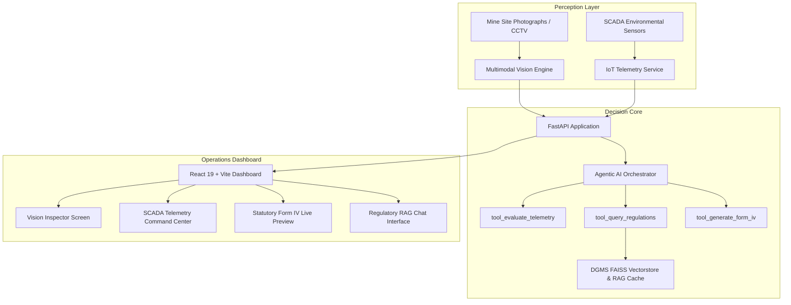

# Digital Mine Safety Officer: Agentic & Multimodal AI

An enterprise AI safety platform designed for Indian underground and opencast coal mining operations under the statutory framework of the **Directorate General of Mines Safety (DGMS)**, the **Coal Mines Regulations (CMR 2017)**, and the **Mines Act 1952**.

The platform combines **Multimodal Computer Vision** (Gemini 2.0 Flash, GPT-4o-mini, and DGMS visual heuristic analysis), **autonomous agentic tool calling** (`tool_evaluate_telemetry`, `tool_query_regulations`, `tool_generate_form_iv`), **real-time IoT SCADA environmental monitoring**, and a **hybrid statutory RAG assistant**.

---

## 1. System Capabilities & Statutory Matrix

| Module | Core Functionality | Statutory Grounding | Automated Output |
| :--- | :--- | :--- | :--- |
| **Multimodal Vision Inspector** | Deep visual analysis of mine photographs for geotechnical hazards (joint spacing, strata fractures, rockfall, highwall tension cracks) and PPE compliance (hard hats, high-vis vests, respirators, cap lamps). | CMR 2017 Reg 123 (Strata Control), Reg 106 (Opencast Highwalls), Mines Rules 1955 Rule 92 | RMR rating, hazard classification (SAFE / WARNING / HIGH / CRITICAL), Overman directives |
| **IoT Telemetry SCADA** | Real-time monitoring across 4 mining districts tracking $CH_4$, $CO$, $O_2$, airflow velocity, ambient temperature, and strata bed separation with anomaly injection drills. | CMR 2017 Reg 153 & 154 (Ventilation Standards, Gas Limits), Reg 123 (Extensometers) | Real-time sensor stream, automatic circuit tripping at $CH_4 \ge 1.25\%$, alarm notifications |
| **Agentic AI Orchestrator** | Autonomous reasoning loop with multi-step statutory tool calling to evaluate hazards, cross-reference regulations, and trigger containment. | CMR 2017 Reg 153(2), Reg 123(4), Mines Act 1952 Sec 22 & 23 | Actionable directives for Mine Manager, Overman, and Sirdar; evacuation protocols |
| **Statutory Form IV Generator** | Automated generation of DGMS Form IV (Notice of Accident & Dangerous Occurrence) with exact legal coordinates, sensor readings, and immediate emergency directives. | Mines Act 1952 Section 23; First Schedule CMR 2017 Reg 8 | Official statutory incident document with verification ID and action logs |
| **Regulatory RAG Assistant** | Dense semantic retrieval over indexed DGMS regulations, circulars, and CMR 2017 handbooks with hybrid vector search and semantic keyword fallbacks. | Coal Mines Regulations 2017 Complete Corpus | Authoritative answers with confidence scoring and direct regulatory excerpts |

---

## 2. Architecture & Workflow

The platform operates across three coordinated layers:



### A. Sensory & Data Ingestion Layer
- **Visual Capture**: Field engineers upload high-resolution inspection photos or select standardized test benchmarks.
- **SCADA Telemetry**: Background telemetry worker continuously monitors and models live environmental and geomechanical sensors across:
  - **District 1**: Main Incline & Shaft Bottom (Haulage & Intake)
  - **District 2**: Longwall Face 4 (Continuous Mining & Active Cutting)
  - **District 3**: Return Airway 3-West (High Methane Layering Risk)
  - **District 4**: Depillaring Sector & Goaf Perimeter (Strata Stress Monitoring)

### B. Decision Core & AI Engines
- **FastAPI Backend (`backend/main.py`)**: RESTful API server, L1 in-memory LRU cache + L2 SQLite store (`rag_cache.db`), and full-stack static asset serving.
- **Multimodal Vision Engine (`backend/vision_inspector.py`)**: Supports Google Gemini (`gemini-2.0-flash`, `gemini-1.5-flash`), OpenAI (`gpt-4o-mini`), and an intelligent PIL-based visual feature extractor (luminance, color variance, fluorescent PPE detection) with complete offline resilience.
- **Agent Orchestrator (`backend/agent_orchestrator.py`)**: Autonomous multi-tool loop that inspects live telemetry, queries regulatory knowledge bases, and drafts statutory emergency reports.

### C. Enterprise Operations Dashboard
- **React 19 + Vite (`frontend/`)**: Modern dashboard with high-contrast mining telemetry panels, live anomaly injection drills, drag-and-drop visual inspection, and Form IV downloads.

---

## 3. Repository Structure

```
mine-agent/
├── Dockerfile                  # Production multi-stage Dockerfile (React + FastAPI)
├── railway.json                # Railway deployment configuration schema
├── .dockerignore               # Optimized Docker build context exclusions
├── .env.example                # Root environment template
├── IMPLEMENTATION.md           # Technical implementation and verification log
├── PROJECT_ANALYSIS_AND_PROPOSAL.md  # Architectural proposal & benchmark audit
├── README.md                   # Complete system documentation
│
├── backend/
│   ├── main.py                 # FastAPI application, static serving, and API endpoints
│   ├── vision_inspector.py     # Multimodal AI vision inspection engine (Gemini/OpenAI/PIL)
│   ├── telemetry_service.py    # Multi-district SCADA simulator & anomaly injection
│   ├── agent_orchestrator.py   # Agentic multi-tool loop & Form IV generation
│   ├── agent.py / agent1.py    # Hybrid RAG retrieval engines (FAISS & CrossEncoder)
│   ├── requirements.txt        # Backend dependencies
│   ├── Dockerfile              # Backend standalone Dockerfile
│   └── vectorstore/            # Indexed DGMS regulations and embeddings
│
└── frontend/
    ├── package.json            # React 19 dependencies & Vite scripts
    ├── vite.config.ts          # Vite build configuration
    ├── public/samples/         # High-resolution benchmark test photographs:
    │   ├── highwall_crack.jpg  # Opencast bench tension fracture
    │   ├── roof_sag.jpg        # Underground roof delamination & sag
    │   ├── ppe_audit.jpg       # Shaft bank worker PPE compliance
    │   └── safe_gallery.jpg    # Compliant systematic support gallery
    └── src/
        ├── App.tsx             # Main layout and view routing
        ├── components/
        │   ├── VisionInspectorScreen.tsx # Visual inspection interface & presets
        │   └── TelemetryScreen.tsx       # Real-time SCADA dashboard & Form IV
        └── services/
            └── geminiService.ts# Unified API client with automatic production routing
```

---

## 4. Railway Step-by-Step Deployment Guide

Deploying the entire full-stack platform (React frontend + Python FastAPI backend) as a single high-performance container on [Railway](https://railway.com):

### Step 1: Connect Your Repository
1. Log in to [Railway](https://railway.com) and click **"New Project"**.
2. Select **"Deploy from GitHub repo"** and select your `mine-agent` repository.

### Step 2: Verify Railway Configuration
The repository includes a root `railway.json` and a unified multi-stage `Dockerfile`:
- **Builder**: `DOCKERFILE`
- **DockerfilePath**: `Dockerfile`
- The build stage automatically installs frontend packages with Node 20, compiles Vite production assets into `frontend/dist`, and copies them into FastAPI's static directory.
- Uvicorn automatically binds to Railway's assigned dynamic port using `${PORT:-8000}`.

### Step 3: Configure Environment Variables in Railway
In the Railway project dashboard under **Variables**, configure:

| Variable | Recommended Value | Description |
| :--- | :--- | :--- |
| `GOOGLE_API_KEY` | `AIzaSy...` | Your Google AI Studio API key (enables Gemini 2.0 Flash live vision). |
| `OPENAI_API_KEY` | *(Optional)* | Your OpenAI API key (enables GPT-4o-mini live vision). |
| `PORT` | `8000` *(Default)* | Injected automatically by Railway. |
| `DB_PATH` | `/app/storage/rag_cache.db` | Location of persistent SQLite cache. |

*(Note: If no API key is provided, the platform automatically activates its built-in DGMS statutory offline engines for vision and agent reasoning).*

### Step 4: Deploy & Access
1. Click **Deploy**. Railway will run the multi-stage build.
2. In Railway **Settings** -> **Networking**, click **"Generate Domain"** (e.g. `iit-d-mineagent-production.up.railway.app`).
3. Open the domain in your browser. The React UI and FastAPI REST backend run seamlessly on the same origin.

---

## 5. Local Development Setup

### Prerequisites
- **Python**: Version 3.10 - 3.14
- **Node.js**: Version 18.x or 20.x with `npm`

### Running the Backend

```bash
cd backend
python -m venv venv

# Windows
.\venv\Scripts\Activate.ps1
# Linux / macOS
source venv/bin/activate

pip install -r requirements.txt
uvicorn main:app --host 0.0.0.0 --port 8000 --reload
```
The backend API is now running at `http://localhost:8000` and Swagger docs at `http://localhost:8000/docs`.

### Running the Frontend

```bash
cd frontend
npm install
npm run dev
```
The frontend dev server runs at `http://localhost:5173` and automatically proxies requests to `http://localhost:8000`.

---

## 6. API Reference

| Method | Endpoint | Description | Request Body | Response Payload |
| :--- | :--- | :--- | :--- | :--- |
| `GET` | `/api` / `/api/health` | Health check & capability manifest | None | `{"status": "OPERATIONAL", "version": "2.0.0"}` |
| `POST` | `/inspect_image` | Multimodal AI visual inspection | `multipart/form-data` with `file` OR JSON `{ "image_base64": "..." }` | Geotechnical analysis, RMR rating, PPE status, statutory alerts, recommendations |
| `GET` | `/telemetry/live` | Real-time multi-district sensor stream | None | Real-time sensor metrics for all 4 districts with active alert evaluation |
| `POST` | `/telemetry/simulate_spike`| Injects an anomaly drill into a zone | `{"zone_id": "ZONE-2", "hazard_type": "ch4_spike"}` | Anomaly status, updated readings, and statutory power trip flag |
| `POST` | `/agent/orchestrate` | Autonomous agentic safety evaluation | `{"query": "Evaluate District 2 hazard"}` | Tool execution trace, live telemetry findings, statutory citations, directives |
| `GET` | `/statutory_form/{zone_id}`| Generates formal DGMS Form IV notice | Optional path param `zone_id` | Official statutory Form IV record with incident ID and emergency directives |
| `POST` | `/statutory_form` | Custom generation of DGMS Form IV | `{"zone_name": "...", "hazard_type": "...", "severity": "...", "details": "..."}` | Statutory notice document |
| `POST` | `/query` | Regulatory RAG Q&A over CMR 2017 | `{"query": "What is the permissible methane limit?"}` | Answer with confidence score |
| `GET` | `/docs` | Interactive OpenAPI / Swagger UI | None | Interactive API documentation |

---

## 7. Statutory Compliance Limits (CMR 2017)

| Parameter | Statutory Threshold | Regulated Action | Platform Automated Response |
| :--- | :--- | :--- | :--- |
| **Methane ($CH_4$)** | $> 0.50\%$ general body<br>$> 1.25\%$ return airway | CMR 2017 Reg 153(2): Cut electrical power, withdraw personnel, improve ventilation. | Sensor triggers `CRITICAL_ALERT`, trips power circuit, and drafts Form IV notice. |
| **Carbon Monoxide ($CO$)** | $> 50\text{ ppm}$ | CMR 2017 Reg 154: Spontaneous combustion warning; investigate immediately. | Flags spontaneous heating warning, directs seal inspection and air sampling. |
| **Oxygen ($O_2$)** | $< 19.00\%$ | CMR 2017 Reg 153(1): Asphyxiation hazard; mandatory withdrawal. | Triggers evacuation alert, directs auxiliary fan inspection. |
| **Strata Bed Separation** | $> 5.0\text{ mm}$ | CMR 2017 Reg 123: Imminent roof fall risk; stop extraction. | Directs supplementary rock bolting, halts continuous miner, logs incident. |
| **Airflow Velocity** | $< 0.50\text{ m/s}$ in face | CMR 2017 Reg 153: Inadequate face dilution velocity. | Flags auxiliary ventilation ducting inspection. |
